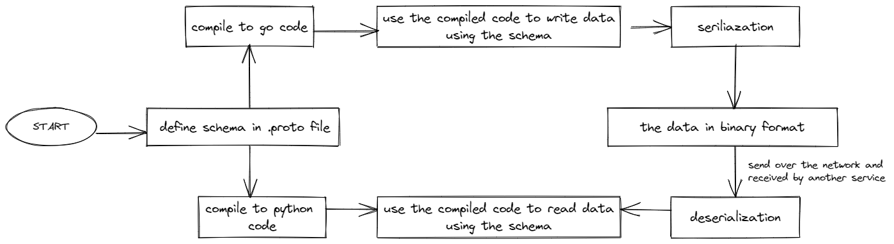

# PROTOBUF (Protocol Buffers)

- Serialising structured data
- Created by Google at 2001
- [Open source](https://github.com/protocolbuffers/protobuf) at 2008
- Platform agnostic
- Serialisation / Deserialisation API in [multiple languages](https://developers.google.com/protocol-buffers/docs/reference/overview)


## Protobuf Components

Protocol buffers are a combination of:
1. The definition language (created in .proto files)
2. The code that the proto compiler generates to interface with data
3. Language-specific runtime libraries
4. The serialization format for data that is written to a file (or sent across a network connection)



### Proto File
Source: https://developers.google.com/protocol-buffers/docs/proto3

```proto
syntax = "proto3"; // Define the version of proto syntax

// Message is the data structure
// in Go, it is like a struct
//
// The field of the message consist of three parts:
// 1. the data type
// 2. the field name
// 3. the unique number to identify your fields in the message binary format
message SearchRequest { 
  string query = 1;
  int32 page_number = 2;
  int32 result_per_page = 3;
}
```

### Protoc
[Protoc](https://developers.google.com/protocol-buffers/docs/proto3#generating) is a CLI tool to generate the language code you need to work with the message types defined in a `.proto` file. We use the generated code to interact with the protobuf data.

[Go plugin for protoc](https://developers.google.com/protocol-buffers/docs/reference/go-generated)

### Language-specific runtime libraries
[Go protobuf library](https://pkg.go.dev/google.golang.org/protobuf/proto)

Run this command to generate Go compiled code
```
protoc --proto_path=src --go_out=out --go_opt=paths=source_relative foo.proto bar/baz.proto
```

## Buf
[Buf](https://github.com/bufbuild/buf) is a CLI tool for working with Protocol Buffer.

1. Configure buf with command `buf mod init`
2. Create `buf.gen.yaml`
    ```
    version: v1
    plugins:
    - name: go
        out: gen/go
        opt: paths=source_relative
    ```
3. Run command `buf lint` to lint the protobuf
4. Run `buf generate` to generate the code
5. Run `go mod tidy` to sync dependencies

## Install clang-format
- https://releases.llvm.org/download.html
- [Clang formation options](https://clang.llvm.org/docs/ClangFormatStyleOptions.html)  
- Run command `clang-format -i .\payment\v1\payment.proto` to reformat the code.

## Read Protobuf Response
` protoc --decode_raw < ./example/payment.bin`

## Protocol Buffer Alternative
- XML
- JSON
- Apache Thrift
- Capnproto
- Flat Buffer
- Microsoft Bond

## When Not To Use Protobuf
- Premature optimisation.
- Your clients are browser.
- [Large data sets*](https://developers.google.com/protocol-buffers/docs/techniques#large-data)  

## When To Consider Protobuf
- Microservice architecture with high throughput of request.
- Need a strict schema. (compared to JSON)

Actually for me, the platform and language agnostic is not the main strength of the tech. Because your platform and your choice of language should be supported by protobuf anyway. And JSON or XML are offering greater support.